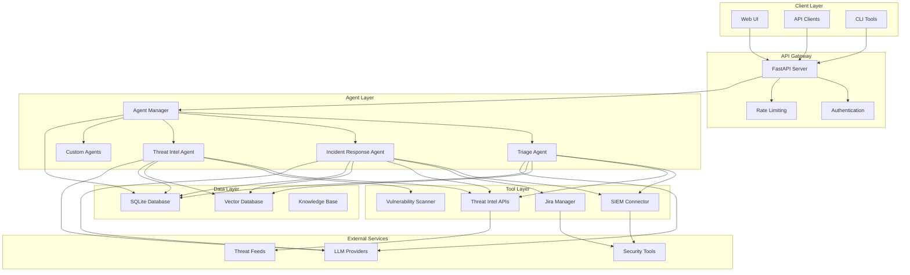
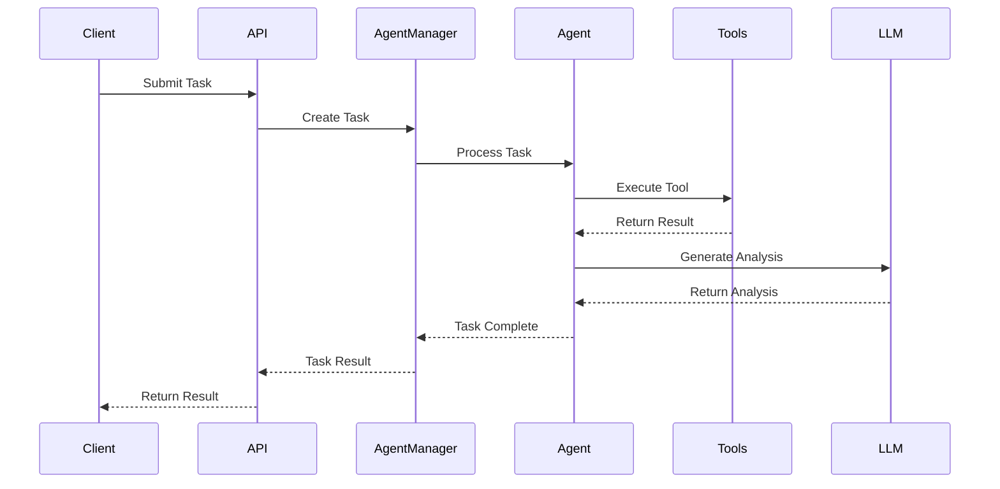

# ZainGuard AI Platform Architecture

## Overview

The ZainGuard AI Platform is a modular, extensible framework for building and deploying AI-powered security operation agents. The architecture is designed to be scalable, maintainable, and easily extensible for different security use cases.

## High-Level Architecture



## Core Components

### 1. Agent Manager

The central orchestration component that manages all AI agents in the system.

**Responsibilities:**
- Agent lifecycle management (create, start, stop, destroy)
- Task distribution and scheduling
- Agent monitoring and health checks
- Inter-agent communication coordination

**Key Classes:**
- `AgentManager`: Main management class
- `BaseAgent`: Abstract base class for all agents
- `AgentTask`: Task representation and tracking

### 2. LLM Interface

Abstraction layer for different Large Language Model providers.

**Supported Providers:**
- OpenAI (GPT-4, GPT-3.5)
- Anthropic (Claude)
- Ollama (Local models)

**Key Features:**
- Unified interface across providers
- Streaming support
- Error handling and retries
- Cost optimization

### 3. Database Layer

**SQLite Database:**
- Agent configurations and metadata
- Task history and status
- Security events and incidents
- Knowledge base documents

**Vector Database (ChromaDB):**
- Semantic search for knowledge base
- Similarity matching for threat intelligence
- RAG (Retrieval-Augmented Generation) support

### 4. Tool Layer

Modular tools that agents can use to interact with external systems.

**Available Tools:**
- **SIEM Connector**: Integration with security information systems
- **Threat Intelligence API**: Multi-source threat intelligence gathering
- **Jira Manager**: Incident and task management
- **Vulnerability Scanner**: Security vulnerability assessment

## Agent Architecture

### Base Agent Structure

```python
class BaseAgent(ABC):
    def __init__(self, agent_id: str, name: str, description: str):
        self.agent_id = agent_id
        self.name = name
        self.description = description
        self.tools = {}
        self.is_running = False
        self.current_tasks = {}
    
    @abstractmethod
    async def process_task(self, task: AgentTask) -> Dict[str, Any]:
        pass
    
    @abstractmethod
    def get_available_tools(self) -> List[str]:
        pass
```

### Agent Lifecycle

1. **Initialization**: Agent is created with configuration
2. **Tool Registration**: Agent registers available tools
3. **Start**: Agent begins processing tasks
4. **Task Processing**: Agent receives and processes tasks
5. **Stop**: Agent stops accepting new tasks and shuts down

### Task Processing Flow



## Security Architecture

### Authentication & Authorization

- **API Key Authentication**: For programmatic access
- **JWT Tokens**: For web UI sessions
- **Role-based Access Control**: Different permission levels

### Data Security

- **Encryption at Rest**: Sensitive data encrypted in database
- **Encryption in Transit**: All API communications use HTTPS
- **Secrets Management**: Environment variables for sensitive configuration
- **Audit Logging**: Comprehensive logging of all actions

### Privacy Considerations

- **Data Minimization**: Only collect necessary data
- **Data Retention**: Configurable retention policies
- **Local Processing**: Option to run entirely on-premises
- **GDPR Compliance**: Built-in privacy controls

## Scalability Design

### Horizontal Scaling

- **Stateless Agents**: Agents can run on multiple instances
- **Load Balancing**: Distribute tasks across agent instances
- **Database Sharding**: Partition data across multiple databases
- **Caching**: Redis for frequently accessed data

### Performance Optimization

- **Async Processing**: Non-blocking I/O operations
- **Connection Pooling**: Reuse database connections
- **Batch Processing**: Process multiple tasks together
- **Caching**: Cache LLM responses and tool results

## Deployment Architecture

### Development Environment

```yaml
services:
  api:
    build: .
    ports:
      - "8000:8000"
    environment:
      - DATABASE_URL=sqlite:///./dev.db
      - VECTOR_DB_PATH=./data/vector_db
  
  redis:
    image: redis:alpine
    ports:
      - "6379:6379"
```

### Production Environment

```yaml
services:
  api:
    image: zainguard/zain-guard-ai:latest
    replicas: 3
    environment:
      - DATABASE_URL=postgresql://user:pass@db:5432/zainguard
      - REDIS_URL=redis://redis:6379
  
  db:
    image: postgres:15
    environment:
      - POSTGRES_DB=zainguard
      - POSTGRES_USER=user
      - POSTGRES_PASSWORD=pass
  
  redis:
    image: redis:alpine
  
  nginx:
    image: nginx:alpine
    ports:
      - "80:80"
      - "443:443"
```

## Monitoring & Observability

### Metrics

- **Agent Performance**: Task processing times, success rates
- **System Health**: CPU, memory, disk usage
- **API Metrics**: Request rates, response times, error rates
- **Business Metrics**: Alerts processed, incidents created

### Logging

- **Structured Logging**: JSON format with correlation IDs
- **Log Levels**: DEBUG, INFO, WARNING, ERROR, CRITICAL
- **Centralized Logging**: ELK stack or similar
- **Audit Trails**: Security-relevant events

### Alerting

- **Health Checks**: Automated monitoring of system components
- **Threshold Alerts**: Performance and error rate alerts
- **Security Alerts**: Unusual activity detection
- **Integration**: PagerDuty, Slack, email notifications

## Extension Points

### Custom Agents

Developers can create custom agents by extending the `BaseAgent` class:

```python
class CustomSecurityAgent(BaseAgent):
    def __init__(self, agent_id: str, name: str, description: str):
        super().__init__(agent_id, name, description)
        # Initialize custom tools
        self.register_tool("custom_tool", self.custom_tool_function)
    
    async def process_task(self, task: AgentTask) -> Dict[str, Any]:
        # Implement custom task processing logic
        pass
    
    def get_available_tools(self) -> List[str]:
        return ["custom_tool"]
```

### Custom Tools

Create new tools by implementing the required interface:

```python
class CustomTool:
    async def execute(self, **kwargs) -> Any:
        # Implement tool functionality
        pass
```

### Plugin System

The platform supports a plugin architecture for:
- New LLM providers
- Additional security tools
- Custom data sources
- Specialized analysis engines

## Future Enhancements

### Planned Features

- **Web UI Dashboard**: Graphical interface for agent management
- **Workflow Engine**: Visual workflow builder for complex processes
- **Machine Learning Pipeline**: Custom model training and deployment
- **Multi-tenancy**: Support for multiple organizations
- **Advanced Analytics**: Business intelligence and reporting

### Integration Roadmap

- **Additional SIEMs**: Splunk, QRadar, ArcSight
- **Cloud Security**: AWS Security Hub, Azure Security Center
- **Threat Feeds**: Commercial and open-source feeds
- **Communication**: Slack, Microsoft Teams, Discord
- **Ticketing**: ServiceNow, Zendesk, Freshdesk

## Conclusion

The ZainGuard AI Platform architecture is designed to be:

- **Modular**: Easy to extend and customize
- **Scalable**: Handle growing workloads
- **Secure**: Built with security best practices
- **Maintainable**: Clean, well-documented code
- **Community-driven**: Open source with active contribution

This architecture provides a solid foundation for building sophisticated AI-powered security operations while maintaining flexibility and ease of use.